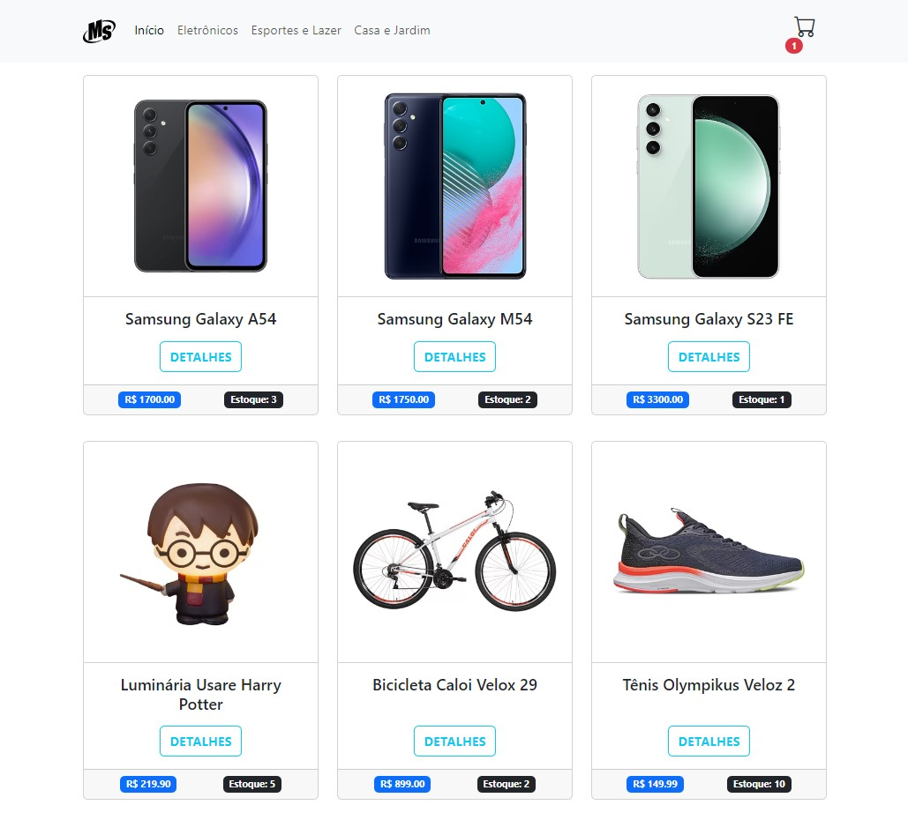

# To-do Vue App

    

#### This project is a frontend challenge.

In this project I developed a shopping App, there are some requirements:

- [x] Use React.js
<!-- - [x] Tasks should have **name**, **description**, **date to complete** and **status** (_complete, incomplete and late_)
- [x] The user should have the option to **update** or **delete** the task *(50%)* -->
- [x] The list of items should have details
- [x] All the frontend should be responsiveness
<!-- - [x] Save all the data on the local storage -->

<!-- This application saves all the data in **local storage**, which means data persist stored in your browser, even after you ending the session.

I decided to use [Pinia](https://pinia.vuejs.org/) instead of Vuex and all the task store is managed by the Pinia state library. -->

### Installation
`yarn install`

### Run application

`yarn start`

The server will be running at [port 3000](http://localhost:3000) _(verify if it is available)_

### Deploy
To deploy this application I used Firebase free service, [click here](https://muambas.web.app/) to see the app.
